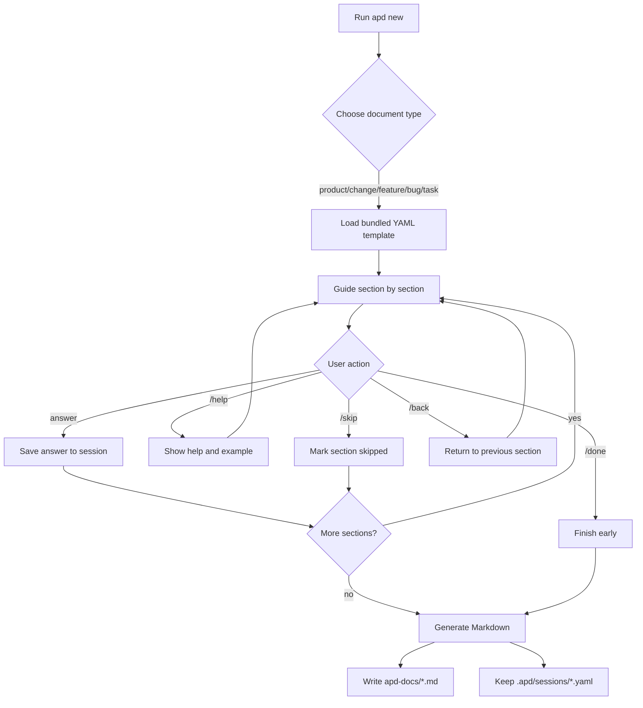

# apd — AI Product Decomposer CLI

`apd` is a local-first Go CLI that turns rough product ideas, changes, features, bugs, or technical tasks into structured, editable Markdown for human review and AI-assisted development.

It does **not** call an AI model. It guides your thinking, saves progress locally, and generates clean files you can edit or paste into your coding agent.

## Quick start

### 1. Run the CLI

```bash
go run . new
```

Choose a document type from the menu:

```txt
1. bug
2. change-request
3. feature
4. product
5. task
```

Or start directly:

```bash
go run . new product
```

### 2. Answer guided sections

Each section shows a short prompt. You can type an answer and finish it with an empty line.

Available commands:

| Command | What it does |
| --- | --- |
| `/help` | Shows help, example, and guide questions for the current section. |
| `/skip` | Marks the current section as skipped. |
| `/back` | Goes back to the previous section so you can replace the answer. |
| `/done` | Finishes early and exports what you have. |

Example:

```txt
Section 1/2: Problem
Describe the current pain or need.
> Users lose important project constraints in scattered chats.
>
```

### 3. Find the generated files

`apd` writes two local outputs:

```txt
.apd/sessions/   # recoverable YAML session state
apd-docs/        # generated Markdown documents
```

The Markdown includes:

- document metadata
- answered sections
- an AI Context Pack
- pending/skipped sections when information is missing

## Flow



## Supported document types

| Type | Use it for |
| --- | --- |
| `product` | Decomposing a new product idea. |
| `change-request` | Describing a change to an existing system. |
| `feature` | Specifying one feature. |
| `bug` | Capturing observed behavior and evidence. |
| `task` | Preparing an implementation task pack. |

## Development

Run checks with:

```bash
go test ./...
go vet ./...
```

Generated local outputs are ignored by git:

```txt
.apd/
apd-docs/
```
